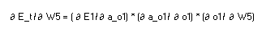
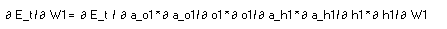

# END2_session2

# Back propagation in Neural Network

In a neural network, back propagation is very important concept which 
is key to correction of weights to reduce the overall loss between
predicted and actual outcomes

# My neural network structure with back propagation illustration and outcome

# Detail steps involved in the back propagation process

## Structure

1. The neural network structure is fully connected and involves 
    - 2 input neurons
    - 1 hidden layer with 2 neurons
    - 2 neurons in the output layer
    - Total 8 parameters - excluding bias for simplicity in process
    

2. Terminologies
    - i1 and i2 are the inputs
    - w1, w2, w3, w4 are weights from input layer to hidden layer
    - w5, w6, w7, w8 are weights from hidden layer to output layer
    - h1 is the pre activation value for 1st neuron of hidden layer
    - a_h1 is the activation output of 1st neuron of hidden layer
    - sigmoid is the activation function
    - h2 is the pre activation value for 2nd neuron of hidden layer
    - a_h2 is the activation output of 2nd neuron of hidden layer
    - o1 is the pre activation value for 1st neuron of output layer
    - a_o1 is the activation output of 1st neuron of output layer
    - o2 is the pre activation value of 2nd neuron of output layer
    - a_o2 is the activation value of 2nd neuron of output layer
    - t1 and t2 are the actual outputs
    
3. Error term
    - Error term E_total = E1 + E2 (errors from 2 output neuron outputs)
    - E1 = squared error difference of t1 and a_o1 = 1/2 square(t1 -a_o1)
    - E2 = squared error difference of t1 and a_o1 = 1/2 square(t2 -a_o2)
    
4. Back propagation calculations
    - Calculate the gradients of E_total with respect to all weights starting from outermost
      layer
      
   - Calculations for the feed forward network
   

   - Calculate the gradients as a part of back propagation 

     
   - Using chain rule to split the calculation of gradients 
   - Back tracking the W5 path - we see a_o1 and o1 as the inputs to the gradient

   - Similarly, calculating the gradients of Error with respect to all weights

   - Extending the gradient calculation till input layer

   - Once all the gradients are calculated, they are multiplied with learning rate and 
     weights are updated with respective gradients
     

   - use updated weights to calculate the other forward network values and finally the error
   - Repeat the back propagation process and weight update till the error reduces

